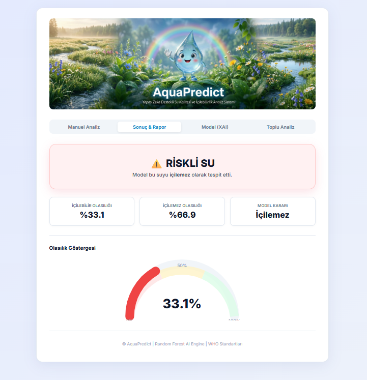
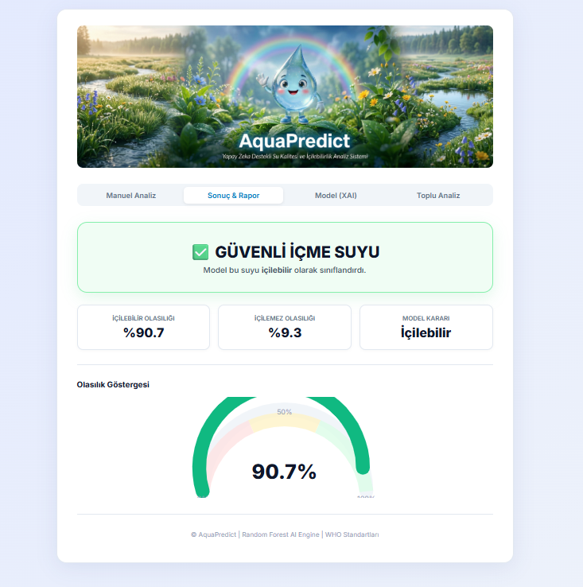
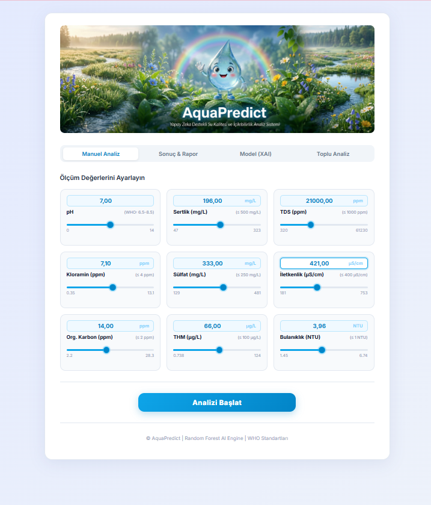
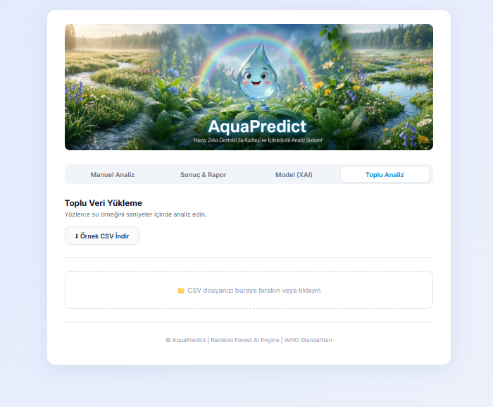

# 💧 AquaPredict: Advanced Water Quality & Potability Analysis

## Gelecek Nesillere Temiz Bir Dokunuş
Temiz içme suyuna erişim, en temel insan haklarından biridir. Çevresel sürdürülebilirliğe katkıda bulunmak ve kimyasal su analiz süreçlerini yapay zeka ile şeffaflaştırabilmek amacıyla geliştirilmiş olan **AquaPredict**; 9 kritik biyokimyasal parametreyi inceleyerek içilebilir su risk analizi yapar.

---

## 🚀 Uygulama Ekran Görüntüleri

Aşağıdaki ekran görüntüleri AquaPredict'in **Flask tabanlı** yeni ve modern web arayüzüne aittir:

### 1. Güvenli Su Profili (İçilebilir)


### 2. Riskli Su Profili (İçilemez)


### 3. Manuel Veri Girişi ve Hızlı Analiz


### 4. Toplu Veri Yükleme (CSV) ve Excel Rapor Çıktısı


---

## 🛠 Teknik Mimari
Uygulamanın mimarisi, yüksek performans ve modern arayüz tasarımı hedefiyle başarıyla **Flask Backend**'ine göç ettirilerek güncellenmiştir:

| Bileşen | Teknoloji / Framework |
| :--- | :--- |
| Yapay Zeka Modeli | Ensemble Learning (**Random Forest Classifier**) |
| Backend Çatısı | Python / **Flask** API (AJAX endpoints) |
| Frontend & UI | Saf HTML5, Özelleştirilmiş Vanilla CSS, Dinamik JavaScript |
| Açıklanabilir Yapay Zeka (XAI) | Flask Endpoint ile Çıkarılan **Feature Importances** & SVG Çizimleri |
| Veri & Log | Pandas, NumPy, Scikit-learn, Openpyxl |

---

## ✨ Temel Özellikler

- **İkili Veri Giriş Opsiyonu:**
  - **Manuel Giriş:** Kaydırmalı slider veya klavye destekli text-input ile hızlı lokal kimyasal testler.
  - **Toplu Analiz Modu (Bulk):** Şehir şebekesi gibi binlerce numunelik su verilerini `.csv` aracılığıyla saniyeler içinde analiz edip sonucunu detaylı bir `.xlsx` (Excel Raporu) halinde indirebilme imkanı.
- **Model Şeffaflığı (XAI) & Radar Grafiği:** Sistem o karar ulaşırken en çok hangi parametreden etkilendiğini anlık çubuk grafik yapısı ve radar poligon grafiğiyle (Dünya Sağlık Örgütü Standartları'nın iz düşümü eşliğinde) şeffaf olarak görselleştirir.
- **Dinamik Göstergeler (Speedometer):** Suyun güvenlilik/içilebilirlik ihtimalini renk değişimleriyle birlikte yüzdelik dinamik hız göstergesine yansıtır.

---

## 💧 Analiz Parametreleri

Model Kaggle Water Potability veri seti ile eğitilmiş ve bu alandaki **9 adet kritik parametreyi** değerlendirmektedir:

1. **pH:** Asit-baz dengesi.
2. **Sertlik (Hardness):** Kalsiyum ve magnezyum gibi minerallerin seviyesi.
3. **TDS (Toplam Çözünmüş Katı):** Suyun içinde çözünmüş maddelerin toplamı (ppm).
4. **Kloramin:** Şebeke dezenfeksiyon kimyasallarının bakiyesi.
5. **Sülfat:** Emilimi doğrudan etkileyebilen sülfat seviyesi.
6. **İletkenlik:** Su içerisindeki serbest iyon konsantrasyon göstergesi.
7. **Organik Karbon:** Sudan numunesindeki temel organik materyallerin ölçümü.
8. **Trihalometan (THM):** Dezenfeksiyonun oluşturduğu potansiyel yan ürün konsantresi.
9. **Bulanıklık (Turbidity):** Suyun ışık geçirgenliği (berraklığı).

*Her bir parametre için WHO standartlarına paralel uyarı mekanizmaları kodlanmıştır.*

---

## 🖥 Kurulum ve Çalıştırma

**1. Repoyu Bilgisayarınıza İndirin:**
```bash
git clone https://github.com/yourusername/aquapredict.git
cd aquapredict
```

**2. Gerekli Kütüphaneleri Yükleyin:**
```bash
pip install -r requirements.txt
```

**3. Flask Uygulamasını Ayağa Kaldırın:**
```bash
python app.py
```

*Terminalinizde belirecek olan `http://127.0.0.1:5000` adresinden tarayıcınız vasıtasıyla AquaPredict sistemine erişebilirsiniz.*
